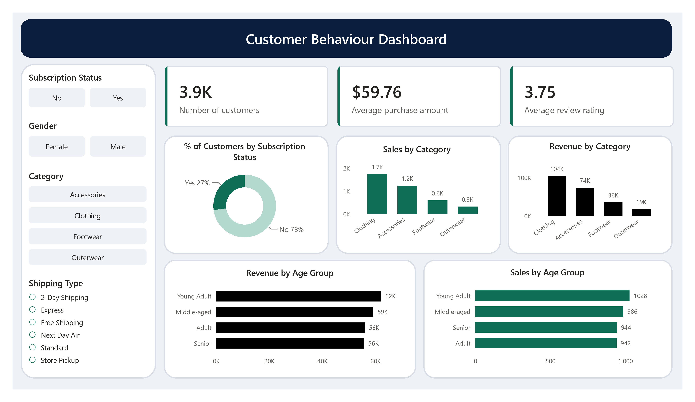

# Customer Shopping Behaviour Analysis

## Project Overview

This project analyzes customer shopping behavior using Python, PostgreSQL, SQL, and Power BI to uncover purchasing patterns, customer segments, product performance, and revenue trends.

The objective is to help businesses make data-driven decisions by understanding customer demographics, shopping preferences, subscription behavior, and purchasing habits.

The project follows a complete end-to-end data analytics workflow, including data cleaning, database integration, SQL analysis, and dashboard development.

---

## Business Problem

A retail company wants to better understand customer shopping behavior in order to improve customer engagement, optimize marketing strategies, increase customer loyalty, and maximize revenue.

Key areas of focus include:

* Customer demographics and purchasing behavior
* Subscription impact on spending
* Product category performance
* Customer segmentation and loyalty
* Revenue contribution across customer groups
* Shipping preferences and purchase trends

---

## Dataset Information

| Attribute      | Value                            |
| -------------- | -------------------------------- |
| Dataset        | Customer Shopping Trends Dataset |
| Total Records  | 3,900                            |
| Total Features | 18                               |
| Missing Values | 37 (Review Rating)               |
| Data Type      | Retail Transaction Data          |

The dataset contains customer demographics, purchase details, subscription status, shipping preferences, review ratings, payment methods, discounts, and purchase frequency information.

---

## Tools & Technologies

* Python
* Pandas
* PostgreSQL
* SQL
* Power BI
* Jupyter Notebook
* SQLAlchemy
* Psycopg2

---

## Project Workflow

### 1. Data Preparation & Cleaning (Python)

* Loaded and explored the dataset using Pandas
* Performed data quality checks
* Handled missing values in review ratings
* Standardized column names using snake_case format
* Created age group categories
* Created purchase frequency metrics
* Removed redundant fields
* Prepared cleaned data for database storage

### 2. Database Integration (PostgreSQL)

* Established PostgreSQL database connection
* Created customer table
* Loaded cleaned dataset into PostgreSQL
* Prepared structured data for SQL analysis

### 3. Business Analysis (SQL)

Performed business-focused analysis to answer the following questions:

1. What is the total revenue generated by male vs female customers?
2. Which customers used discounts but still spent above the average purchase amount?
3. Which products have the highest average review ratings?
4. How do purchase amounts compare between Standard and Express shipping?
5. Do subscribers spend more than non-subscribers?
6. Which products have the highest percentage of discounted purchases?
7. How can customers be segmented into New, Returning, and Loyal groups?
8. What are the top-performing products within each category?
9. Are repeat buyers more likely to subscribe?
10. What is the revenue contribution of each age group?

---

## Power BI Dashboard

The interactive dashboard provides a comprehensive overview of customer shopping behavior through:

* Total Customers KPI
* Average Purchase Amount KPI
* Average Review Rating KPI
* Subscription Analysis
* Sales by Category
* Revenue by Category
* Revenue by Age Group
* Sales by Age Group
* Interactive Filters and Slicers

### Dashboard Preview

---

## Key Insights

* Clothing generated the highest overall revenue among product categories.
* Young Adult customers contributed the highest revenue among age groups.
* Customer segmentation revealed opportunities for loyalty and retention programs.
* Subscription behavior can be leveraged to improve customer engagement.
* Product category performance provides valuable insights for inventory and marketing planning.

---

## Business Recommendations

### Increase Subscription Adoption

Encourage customers to subscribe through exclusive benefits and personalized offers.

### Strengthen Customer Loyalty Programs

Reward repeat customers and encourage progression toward loyal customer segments.

### Focus on High-Performing Categories

Allocate marketing and inventory resources toward top-performing product categories.

### Implement Personalized Marketing

Use demographic and behavioral insights to create targeted campaigns.

### Leverage Dashboard Analytics

Continuously monitor customer trends to support data-driven business decisions.

---

## Repository Structure

customer-shopping-behaviour-analysis/

├── data/

│ └── customer_shopping_behavior.csv

├── notebooks/

│ └── Customer_Shopping_Behaviour_Analysis.ipynb

├── sql/

│ └── queries.sql

├── powerbi/

│ └── Customer_Shopping_Behaviour_Dashboard.pbix

├── reports/

│ └── Customer_Shopping_Behaviour_Report.pdf

├── dashboard_screenshots/

│ └── dashboard.png

├── README.md

└── requirements.txt

---

## Files Included

* Jupyter Notebook for data preparation and cleaning
* SQL queries for business analysis
* PostgreSQL integration workflow
* Interactive Power BI dashboard
* Project report
* Dashboard screenshots

---

## Author

**Arpit Gupta**

Aspiring Data Analyst

LinkedIn: [www.linkedin.com/in/arpit-gupta1105](http://www.linkedin.com/in/arpit-gupta1105)
